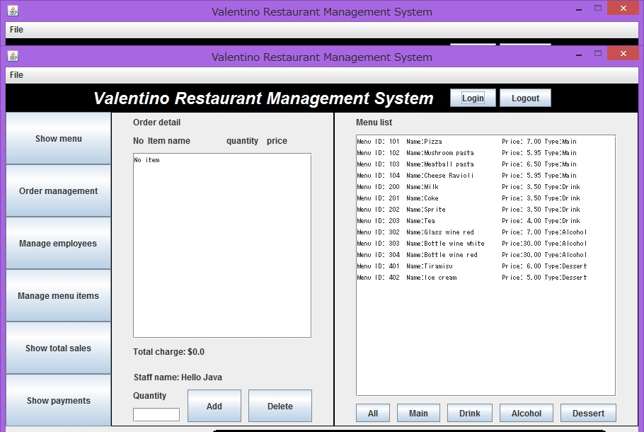

/**
 * Version 2.5.9 - Date 17-07-2022
 * Abhinav Bammidi
 */
# Valentino Resutaurant Management System (RMS)
Valentino Restaurant, an iconic and renowned Italian culinary haven, has long been celebrated for its exquisite cuisine, charming ambiance, and exceptional service. Nestled in the heart of the city, it has earned a stellar reputation for crafting delectable dishes that showcase the true essence of Italian gastronomy. As a go-to destination for food enthusiasts and connoisseurs alike, Valentino Restaurant has witnessed a surge in its popularity, leading to a need for a robust restaurant management system that can seamlessly handle the diverse demands of its flourishing business.

In response to this requirement, a state-of-the-art restaurant management system has been meticulously developed using core Java. Leveraging the power and versatility of this programming language, the system has been tailored to cater specifically to the unique needs of Valentino Restaurant. The use of core Java ensures a robust and scalable foundation, allowing for efficient management of various facets of the restaurant's operations, including reservations, order processing, inventory management, and staff scheduling. The system's user-friendly interface enhances the overall dining experience for both customers and staff, promoting smoother interactions and streamlined processes. With this innovative solution in place, Valentino Restaurant is poised to elevate its operational efficiency and maintain its stellar reputation in the culinary world.

## Execute
java -jar RMS_GUI.jar

## Login
You can use test data for the first time. You can add new staff when you log in as manager.
Manager : Id-1000, Password-9999
Staff: Id-1100, Password-9998

## Show menu
You can see all menu items by clicking ALL button, and items in particular categories by clicking Drink, Alcohol, Main, or Dessert button.  
## Taking order
### Create new order
1. Click "Show menu" button on the left
2. Click "New" button to create new order

3. Select adding items by clicking from the menu list on the right side.
4. Enter quantity and click "Add" button on the left side.(If quantity is emputy, one item will be added)
5. You can delete ordered item from the order detail by clicking "Delete" button  

### Edit order
1. Click "Show menu" button on the left
2. Select the order from the order list to edit
3. Click "Edit" button
4. You can add, delete ordered items

### Close or Cancel order
1. Select the order from the order list
2. Click "Close" button or "Cancel" button
3. The order closed or canceled can not edit

## Manage Employees (Manager only)
### Add new staff
1. Click "Manage Employees" Button on the left
2. Click "New" button
3. Fill in all information and click OK

###Edit staff
1. Click "Manage Employees" Button on the left
2. Select a staff from the employees list
3. Click "Edit" button
4. Fill in all information and click OK

###Delete staff
1. Click "Manage Employees" Button on the left
2. Select a staff from the employees list
3. Click "Delete" button

##Manage Menu Items (Manager only)
###Add new item
1. Click "Manage menu items" Button on the left
2. Click "Add new menu item" button
3. Fill in all information and click OK

###Edit menu item
1. Click "Manage menu items" Button on the left
2. Select a menu item from the menu list
3. Click "Edit menu item" button
4. Fill in all information and click OK

###Delete menu item
1. Click "Manage menu items" Button on the left
2. Select a menu item from the menu list
3. Click "Delete menu item" button

##About payments
* When you log in, the system automaticaly set start working time.
* Clock out button will set finish working time of the person currently logged in.
* Manager can make staff clocked out via manage employees, by selecting staff and clicking Clock out button.
* You can see a payment details for a day by clicking "Show payment" button on the left 
